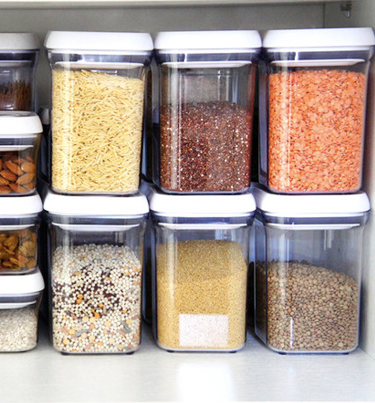
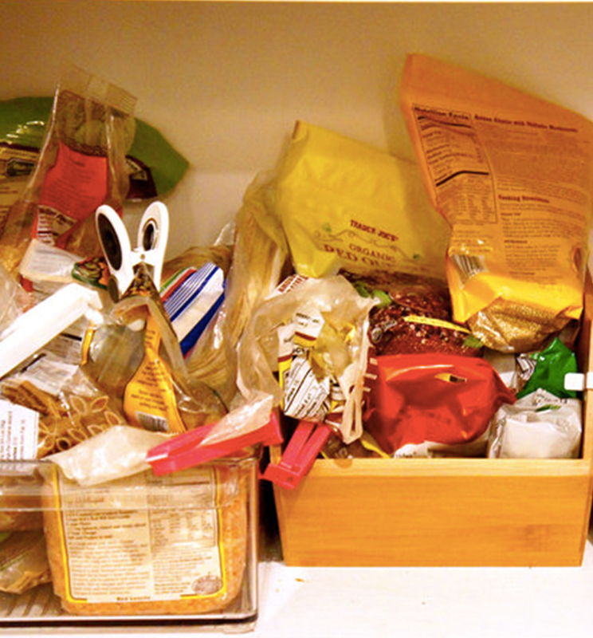

<link href='custom.css' rel='stylesheet' type='text/css'>

<!--=================================================================================================== -->
## <h2 style="color:white;">Good software <br/> engineering practices</h2>
<!--=================================================================================================== -->
<!-- .slide: style="color:white" -->
<!-- .slide: data-background="img/code.png" -->

UE programmation orientée objet

Master bioinfo

Automne 2019


---

### Who am I?

_Vincent Lanore_

Send questions at:

[vincent.lanore@univ-lyon1.fr](mailto:vincent.lanore@univ-lyon1.fr)


---

### Software engineering courses

|                 |               |                |                        |
|-----------------|---------------|----------------|------------------------|
| today           | 9:45am to 1pm | nautibus TD11  | good coding practices  |
| monday sep 30th | 9:45am to 1pm | ??             | object-oriented design |


---

Slides are available at http://vlanore.eu:1948

Example code is available at<br/> https://github.com/vlanore/prog_m1_bioinfo


---

<!--=================================================================================================== -->
## <h2 style="color:white;">Introduction</h2>
<!--=================================================================================================== -->
<!-- .slide: style="color:white" -->
<!-- .slide: data-background="img/code.png" -->


---

Two programs that do the same thing<br/>are not necessarily equal


---


<div id="left">
Good code is __elegant__<br/> and __well-organized__...


</div>

<div id="right">
    

... while bad code is<br/>__messy__ and __fragile__
</div>
<!-- .element: class="fragment" data-fragment-index="1" -->
<!-- image source : https://www.simplyspaced.com/2016/08/28/organizing-before-and-after-transformations/ -->


---

<!-- .slide: style="font-size: 0.65em" -->

### Code can be very obtuse

```txt
        #define/*__Int3rn^ti[]n/l_()I3fusc^t3|]_C_C<>I7E_C[]nt3st__*/L/*__MMXVIII__*/for
    #include/*!"'()*+,-./12357:;<=>?CEFGHIJKLMNSTUVWXYZ[]^_`cfhijklmnrstuvwxyz{|}*/<stdio.h>
  char*r,F[1<<21]="~T/}3(|+G{>/zUhy;Jx+5wG<v>>u55t.?sIZrC]n.;m+:l+Hk]WjNJi/Sh+2f1>c2H`)(_2(^L\
 -]=([1/Z<2Y7/X12W:.VFFU1,T77S+;N?;M/>L..K1+JCCI<<H:(G*5F--E11C=5?.(>+(=3)Z-;*(:*.Y/5(-=)2*-U,\
/+-?5'(,+++***''EE>T,215IEUF:N`2`:?GK;+^`+?>)5?>U>_)5GxG).2K.2};}_235(]:5,S7E1(vTSS,-SSTvU(<-HG\
-2E2/2L2/EE->E:?EE,2XMMMM1Hy`)5rHK;+.T+?[n2/_2{LKN2/_|cK2+.2`;}:?{KL57?|cK:2{NrHKtMMMK2nrH;rH[n"
"CkM_E21-E,-1->E(_:mSE/LhLE/mm:2Ul;2M>,2KW-+.-u).5Lm?fM`2`2nZXjj?[n<YcK?2}yC}H[^7N7LX^7N7UN</:-\
ZWXI<^I2K?>T+?KH~-?f<;G_x2;;2XT7LXIuuVF2X(G(GVV-:-:KjJ]HKLyN7UjJ3.WXjNI2KN<l|cKt2~[IsHfI2w{[<VV"
"GIfZG>x#&#&&$#$;ZXIc###$&$$#>7[LMv{&&&&#&##L,l2TY.&$#$#&&$,(iiii,#&&&#$#$?TY2.$#$1(x###;2EE[t,\
SSEz.SW-k,T&&jC?E-.$##      &#&57+$$#      &&&W1-&$$7W  -J$#$kEN&#&      $##C^+$##W,h###n/+L2YE"
"2nJk/H;YNs#$[,:TU(#$   ,:   &&~H>&#   Y;   &&G_x&#2;   ,mT&$YE-#&   5G   $#VVF$#&zNs$$&Ej]HELy\
CN/U^Jk71<(#&:G7E+^&#  l|?1  $$Y.2$$  7lzs  WzZw>&$E    -<V-wE(2$$  G>x;  2zsW/$$#HKt&$$v>+t1(>"
"7>S7S,;TT,&$;S7S>7&#>E_::U  $$'",op  ,*G=  F,*I=957+F  ;int*t,k,O,  i,   j,T[+060<<+020];int M(
int m,int nop){;;;return+   m%(0+nop  );;}  int*tOo,w,  h,z,W;void(C)  (int n){n=putchar(n);}int
f,c,H=11,Y=64<<2,Z,pq,X   ;void(E/*d  */)(  int/*RP*/n  ){L(Z=k+00;  Z;  Z/=+2+000)G[000]=*G*!!f
|M(n,2)<<f,pq=2,f=+06   <f?++pq,++pq  ,G++  ,z:f+001,n  /=2;;}void  (V)(  int/*opqrstabd*/n){C(n
%Y);;C(n/Y+00);;}void  J(){L(pq--,pq   =j   =O=-1+0;++  j<240;I[6+   (h   +6+j/12/2*2+M(j/2,2))*
W+M(j/2/2,+06)*2+w*014      +00+M(00+      000+j,002      +00)]=000      +00+k)k=M(G[j/2/2+(*r-+
32)**"<nopqabdeg"],/*4649&96#*/3);/*&oaogoqo*/;}/*xD%P$Q#Rq*/int/*dbqpdbqpxyzzyboo3570OQ*/main()
{L(X=Y-1;i<21*3;i++,I++)L(r=G,G+=2;*G++;)*G>=13*3?*G-*r?*I++=*G:(*I++=r[1],*I++=r[2]):1;L(j=12,r
=I;(*I=i=getchar())>-1;I++)i-7-3?I-=i<32||127<=i,j+=12:(H+=17+3,W=W<j?j:W,j=12);L(;*r>-1;r++)*r-
7-3?J(),w++:(w=z,h+=17+3);C(71);C(73);V('*'*'1'*7);C(57);C(32*3+1);V(W);V(H);C(122*2);L(V(i=z);i
<32*3;)C(i++/3*X/31);C(33);C(X);C(11);L(G="SJYXHFUJ735";*G;)C(*G++-5);C(3);V(1);L(V(j=z);j<21*3;
 j++){k=257;V(63777);V(k<<2);V(M(j,32)?11:511);V(z);C(22*2);V(i=f=z);V(z);V(W);V(H);V(1<<11);r=
  G=I+W*H;L(t=T;i<1<<21;i++)T[i]=i<Y?i:-1;E(Y);L(i=-1;++i<W*H;t=T+Z*Y+Y)c=I[i]?I[i]*31-31:(31<
    j?j-31:31-j),Z=c[t[c]<z?E(Z),k<(1<<12)-2?t[c]=++k,T:T:t];E(Z);E(257);L(G++;k=G-r>X?X:G-r
        ,C(k),k;)L(;k--;C(*r++/*---#$%&04689@ABDOPQRabdegopq---*/));}C(53+6);return(z);}
```

https://www.ioccc.org/years-spoiler.html#2018        


---

### Code quality is important

<div id="left">
    Other people might interact with your code:<p/>
    <ul>
        <li> collaborators </li>
        <li> users </li>
        <li> random people from the web </li>
        <li> yourself from the future </li>
    </ul>
</div>

<div id="rightleft">
    To:<p/>
    <ul>
        <li> use </li>
        <li> add functionality </li>
        <li> correct bugs </li>
        <li> integrate in other programs </li>
        <li> ... </li>
    </ul>
</div>
<!-- .element: class="fragment" data-fragment-index="1" -->


---


### Good code saves time

Writing good code takes more time...

<div> ...but it saves a lot of time in the long run! 

</div>
<!-- .element: class="fragment" data-fragment-index="1" -->


---

<!--=================================================================================================== -->
## <h2 style="color:white;">Example:<br/>parsing FASTA files</h2>
<!--=================================================================================================== -->
<!-- .slide: style="color:white" -->
<!-- .slide: data-background="img/code.png" -->


---

### FASTA files

This is a FASTA file:

```fasta
>SEQUENCE_1
MTEITAAMVKELRESTGAGMMDCKNALSETNGDFDKAVQLLREKGLGKAAKKADRLAAEGLVSVKVSDDFTIAAMRPSYLSYEDLDMTFVENEYKALVAELEKENEERR
>SEQUENCE_2
SATVSEINSETDFVAKNDQFIALTKDTTAHIQSNSLQSVEELHSSTINGVKFEEYLKSQIATIGENLVVRRFATLKAGANGVVNGYIHTNGRVGVVIAAACDSAEVASKSRDLLRQICMH
```

Lines starting with `>` are sequence names<br/>
they are followed by the sequence in plain text


---

### A fasta parser in python

__Goal:__ write a function that<br/>
takes the path to a fasta file
```path
~/data/example.fasta```
and returns a list of sequences
```python
[('SEQUENCE1', 'AGMMD...'),
 ('SEQUENCE2', 'MMDGGAA...')]
```


----

### Algorithm

1. Read the file
2. Initialize empty list _r_
3. For every line _l_ in the file
    1. if it starts with _>_, store _l_ in a variable _n_
    2. otherwise, add (_n_, _l_) to _r_
4. Return _r_


----

### Implementation in python

```python
def read(fn):
    f = open(fn, 'r')
    ls = f.readlines()
    r, n = [], ""
    for l in ls:
        if l[0] == '>':
            n = l[1:].strip()
        else:
            r.append((n, l.strip()))
    return r
```

Quick testing:
```python
In [1]: %run read_fasta.py
In [2]: read("../data/example.fasta")
Out[2]: 
[('SEQUENCE_1',
  'MTEITAAMVKELRESTGAGMMDCKNALSETNGDFDKAVQLLREKGLGKAAKKADRLAAEGLVSVKVSDDFTIAAMRPSYLSYEDLDMTFVENEYKALVAELEKENEERR'),
 ('SEQUENCE_2',
  'SATVSEINSETDFVAKNDQFIALTKDTTAHIQSNSLQSVEELHSSTINGVKFEEYLKSQIATIGENLVVRRFATLKAGANGVVNGYIHTNGRVGVVIAAACDSAEVASKSRDLLRQICMH')]
```
<!-- .element: class="fragment" data-fragment-index="1" -->

---

<!--=================================================================================================== -->
## <h2 style="color:white;"> Improving code readability </h2>
<!--=================================================================================================== -->
<!-- .slide: style="color:white" -->
<!-- .slide: data-background="img/code.png" -->

---

### Adding comments

> __Comments__: text in a program that is<br/> ignored by the compiler/interpreter

* used to clarify complex code
* __target__: developers (including yourself)

```python
# if the line starts by > this is a sequence name
if l[0] == '>':
    n = l[1:].strip()  # store in the n buffer
```
<!-- .element: class="fragment" -->


---

### Adding documentation

> __Documentation__: text explaining<br/>how to use a program

* __target__: users
* can be external (_e.g.,_ in a README),<br/>or inside the code

```python
def read(fn):
    """A function that reads the fasta file located at fn
    and outputs a list of (name, sequence)"""
```
<!-- .element: class="fragment" -->


---

#### Updated example

```python
def read(fn):
    """A function that reads the fasta file located at fn
    and outputs a list of (name, sequence)"""

    # Step 1: reading file
    f = open(fn, 'r')
    ls = f.readlines()

    # Step 2: going through the lines
    r = []  # result (a list)
    n = ""  # buffer for sequence names
    for l in ls:
        # if the line starts by > this is a sequence name
        if l[0] == '>':  
            n = l[1:].strip()  # store in the n buffer
        else:  # otherwise it's sequence data
            # add tuple (name, data) to result
            r.append((n, l.strip()))
    return r
```


---

### Better names

__Variable names__ and __function names__<br/>can be used to clarify code

Give them names with __meaning__

----

For example, don't write

```python
r = []
n = ""
```

but instead write

```python
result = []
name_buffer = ""
```

----

#### Updated example

```python
def read_fasta(fasta_filename):
    """A function that reads the fasta file located at fn
    and outputs a list of (name, sequence)"""

    # Step 1: reading file
    fasta_file = open(fasta_filename, 'r')
    line_list = fasta_file.readlines()

    # Step 2: going through the lines
    result = []  # result (a list)
    name_buffer = ""  # buffer for sequence names
    for line in line_list:
        # if the line starts by > this is a sequence name
        if line[0] == '>':
            # store in the name buffer
            name_buffer = line[1:].strip()
        else:  # otherwise it's sequence data
            # add tuple (name, data) to result
            result.append((name_buffer, line.strip()))
    return result
```


---

### Self-documenting code

Simple code with good variable names<br/> is often __self-explanatory__

Example:

```python
# Step 1: reading file
fasta_file = open(fasta_filename, 'r')
line_list = fasta_file.readlines()
```

----

Comments can become useless

```python
result = []  # result (a list)
name_buffer = ""  # buffer for sequence names
```

----

Sometimes, rewriting can help<br/>clarify without comments

```python
# if the line starts by > this is a sequence name
if line[0] == '>':
    ...
```

could instead be written

```python
is_sequence_name = (line[0] == '>')
if is_sequence_name:
    ...
```

----

```python
def read_fasta(fasta_filename):
    """A function that reads the fasta file located at fn
    and outputs a list of (name, sequence)"""

    # Step 1: reading file
    fasta_file = open(fasta_filename, 'r')
    line_list = fasta_file.readlines()

    # Step 2: going through the lines
    result = [] 
    name_buffer = ""
    for line in line_list:
        is_sequence_name = (line[0] == '>')
        if is_sequence_name:
            name_buffer = line[1:].strip()
        else:  # otherwise it's sequence data
            result.append((name_buffer, line.strip()))
    return result
```

---

### Indentation

Indentation and spacing are important for clarity

* break or avoid long lines
* highlight structure

(In python indentation is mandatory)

----

### Automatic indentation

Using text editors or dedicated tools

* easier to use
* more consistent across files
* more consistent across users

----

#### Indentation examples

---

### Code clarity recap

* use comments
* provide documentation
* strive for self-documenting code
* use indent and spacing to organize

----

Find a style that suits you<br/>and your collaborators!

---

<!--=================================================================================================== -->
## <h2 style="color:white;"> Organizing your<br/>project files</h2>
<!--=================================================================================================== -->
<!-- .slide: style="color:white" -->
<!-- .slide: data-background="img/code.png" -->

---

### README

Write a readme, _i.e.,_ a small text file that

* explains what your code is
* how to install/use it

File name is usually `README`, `README.txt`<br/>or `README.md` (markdown)

---

### License

If you publish your code (_e.g.,_ on github)<br/>
choose a license for it

Put the license text in the project folder,<br/>typically in a `LICENSE` file

---

### Organize using subfolders

* general config and info files at the top
* folder for source code (typically `src/`)
* folder for data
* folder for utility scripts
* ...

----

#### typical project data structure

```txt
.
├── data
│   ├── besnard
│   │   ├── cyp_coding.Chrysithr_root.nhx
│   │   ├── cyp_coding.fna
│   │   └── cyp_coding.phy
├── LICENSE.txt
├── Makefile
├── README.md
├── scripts
│   ├── dataset_levure.R
│   ├── dataset_levure.sh
└── src
    ├── arrays.hpp
    ├── chrono.hpp
    ├── test.cpp
    └── utils.hpp
```

---

### Version control

Always use version control (_e.g.,_ git) for your code,<br/>
even when it's small

---

<!--=================================================================================================== -->
## <h2 style="color:white;"> Code refactoring </h2>
<!--=================================================================================================== -->
<!-- .slide: style="color:white" -->
<!-- .slide: data-background="img/code.png" -->

---

> __Refactoring__ is the process or rewriting code to make it better without changing what it does


----

<p style="margin-left:-300px">Examples of refactoring operations:<p>

* making code clearer (comments, names, doc)
* reorganizing
* code factorization
* use better algorithms


---

### Refactoring example

We could simplify the contents of the for loop

```python
def read_fasta(fasta_filename):
    """A function that reads the fasta file located at fn
    and outputs a list of (name, sequence)"""

    # Step 1: reading file
    fasta_file = open(fasta_filename, 'r')
    line_list = fasta_file.readlines()

    # Step 2: going through the lines
    result = [] 
    name_buffer = ""
    for line in line_list:
        is_sequence_name = (line[0] == '>')
        if is_sequence_name:
            name_buffer = line[1:].strip()
        else:  # otherwise it's sequence data
            result.append((name_buffer, line.strip()))
    return result
```

----

```python
    # Step 2: going through the lines
    result = [] 
    name_buffer = ""
    for line in line_list:
        is_sequence_name = (line[0] == '>')
        if is_sequence_name:
            name_buffer = line[1:].strip()
        else:  # otherwise it's sequence data
            result.append((name_buffer, line.strip()))
```

can be changed to

```python
    # Step 2: going through the sequences
    result = []
    nb_sequences = int(len(line_list) / 2)
    for sequence_index in range(nb_sequences):
        sequence_name = line_list[2 * sequence_index][1:].strip()
        sequence_data = line_list[2 * sequence_index + 1].strip()
        result.append((sequence_name, sequence_data))
```

----

### Benefits
<!-- .slide: style="font-size: 0.9em" -->

* code is shorter
* code is less complex (no nested control structures)
* fact that data follows sequence name is more apparent
* name buffer was confusing and error-prone

----

```python
def read_fasta(fasta_filename):
    """A function that reads the fasta file located at fn
    and outputs a list of (name, sequence)"""

    # Step 1: reading file
    fasta_file = open(fasta_filename, 'r')
    line_list = fasta_file.readlines()

    # Step 2: going through the sequences
    result = []
    nb_sequences = int(len(line_list) / 2)
    for sequence_index in range(nb_sequences):
        sequence_name = line_list[2 * sequence_index][1:].strip()
        sequence_data = line_list[2 * sequence_index + 1].strip()
        result.append((sequence_name, sequence_data))
    return result
```


---

### LIVE CODING: REFACTORING

Refactoring of python script

```txt
code/ugly_code.py
```

from the github repository: 

https://github.com/vlanore/prog_m1_bioinfo


---

<!--=================================================================================================== -->
## <h2 style="color:white;"> Parsing command line arguments </h2>
<!--=================================================================================================== -->
<!-- .slide: style="color:white" -->
<!-- .slide: data-background="img/code.png" -->

---

https://github.com/vlanore/docopt-boiteaoutils

---

<!--=================================================================================================== -->
## <h2 style="color:white;"> Writing correct code </h2>
<!--=================================================================================================== -->
<!-- .slide: style="color:white" -->
<!-- .slide: data-background="img/code.png" -->

---

### Errors

Sometimes, code will do something wrong

* wrong parameters
* bug
* hardware/system faults
* ...

----

<div style="margin-left:-200px">Code should handle these errors</div>

* display a message
* avoid continuing with invalid state

----

```python
    # Step 2: going through the sequences
    result = []
    nb_sequences = int(len(line_list) / 2)
    for sequence_index in range(nb_sequences):
        first_line_index = 2 * sequence_index
        if (line_list[first_line_index][0] != '>'):
            print("Error: Line " + str(first_line_index)
                + " does not start with >")
            sys.exit(1)
        sequence_name = line_list[first_line_index][1:].strip()
        sequence_data = line_list[first_line_index + 1].strip()
        result.append((sequence_name, sequence_data))
```


---

### Warnings

Some behaviours are not technically<br/>errors but look _suspicious_

Displaying a message to __warn__<br/>the user can help detect problems

----

__Example:__ Empty fasta file might be a user error

```python
# Step 1: reading file
fasta_file = open(fasta_filename, 'r')
line_list = fasta_file.readlines()
if (len(line_list) == 0):
    print("Warning: File " + fasta_filename + " is empty!")
```


---

<!-- .slide: style="font-size: 0.78em" -->

```python
def read_fasta(fasta_filename):
    """A function that reads the fasta file located at fn
    and outputs a list of (name, sequence)"""

    # Step 1: reading file
    fasta_file = open(fasta_filename, 'r')
    line_list = fasta_file.readlines()
    if (len(line_list) == 0):
        print("Warning: File " + fasta_filename + " is empty!")

    # Step 2: going through the sequences
    result = []
    nb_sequences = int(len(line_list) / 2)
    for sequence_index in range(nb_sequences):
        first_line_index = 2 * sequence_index
        if (line_list[first_line_index][0] != '>'):
            print("Error: Line " + str(first_line_index)
                + " does not start with >")
            sys.exit(1)
        if (line_list[first_line_index + 1][0] == '>'):
            print("Error: Line " + str(first_line_index + 1)
                + " starts with >")
            sys.exit(1)
        sequence_name = line_list[first_line_index][1:].strip()
        sequence_data = line_list[first_line_index + 1].strip()
        result.append((sequence_name, sequence_data))
    return result
```


---

### Asserts

In practice, many errors are just checking<br/>for a condition that must be true

Having many cases like this is verbose

```python
if (line_list[first_line_index + 1][0] == '>'):
    print("Error: Line " + str(first_line_index + 1)
        + " starts with >")
    sys.exit(1)
```

----

Instead one can just write
```python
assert condition 
```
or
```python
assert condition, "message"
```
to check a condition and fail if it is not met

----

```python
def read_fasta(fasta_filename):
    """A function that reads the fasta file located at fn
    and outputs a list of (name, sequence)"""

    # Step 1: reading file
    fasta_file = open(fasta_filename, 'r')
    line_list = fasta_file.readlines()
    if (len(line_list) == 0):
        print("Warning: File " + fasta_filename + " is empty!")

    # Step 2: going through the sequences
    result = []
    nb_sequences = int(len(line_list) / 2)
    for sequence_index in range(nb_sequences):
        first_line_index = 2 * sequence_index
        assert line_list[first_line_index][0] == '>'
        assert line_list[first_line_index + 1][0] != '>'
        sequence_name = line_list[first_line_index][1:].strip()
        sequence_data = line_list[first_line_index + 1].strip()
        result.append((sequence_name, sequence_data))
    return result
```

<!-- --- -->
<!-- ### Exceptions -->

---

### Logging

Sometimes, it's useful to display general info

* to help debug code
* to inform user of what's happening
* to keep a trace

----

Can be done by hand

```python
# Step 1: reading file
print("Opening fasta file!")
fasta_file = open(fasta_filename, 'r')
line_list = fasta_file.readlines()
print("Done.")
```

----

Can be done using a lib

```python
import logging
```

```python
logging.info("Opening fasta file!")
fasta_file = open(fasta_filename, 'r')
line_list = fasta_file.readlines()
logging.info("Done.")
```

----

Messages are divided into levels

* critical (very important)
* errors (important)
* warning
* info
* debug (not useful most of the time)

----

Levels can be turned on/off, customized or sent to files

In main file:
```python
logging.basicConfig(filename='example.log',level=logging.DEBUG)
```

See `code/read_fasta_logging.py` in repository

---

<!--=================================================================================================== -->
## <h2 style="color:white;"> Testing </h2>
<!--=================================================================================================== -->
<!-- .slide: style="color:white" -->
<!-- .slide: data-background="img/code.png" -->

---

### Untested code is probably wrong

Making mistakes while coding is easy

You should __always__ test your code to see if it works

---

### Testing by hand

For example, adding code at the end of the file

```python
if __name__ == "__main__":
    print(read_fasta("data/example.fasta"))
```

and run

```bash
$ python code/read_fasta.py
[('SEQUENCE_1', 'MTEITAAMVKELRESTGAGMMDCKNALSETNGDFDKAVQLLREKGLGKAAKKADRLAAEGLVSVKVSDDFTIAAMRPSYLSYEDLDMTFVENEYKALVAELEKENEERR'), ('SEQUENCE_2', 'SATVSEINSETDFVAKNDQFIALTKDTTAHIQSNSLQSVEELHSSTINGVKFEEYLKSQIATIGENLVVRRFATLKAGANGVVNGYIHTNGRVGVVIAAACDSAEVASKSRDLLRQICMH')]
```

----


Or, write a `test_read_fasta.py` file

```python
from read_fasta import read_fasta

print(read_fasta(read_fasta))
```

---

### Automating test results

Instead of checking by reading the output,<br/>
write checks inside the tests

```python
import sys
from read_fasta import read_fasta

expected_data = [('SEQUENCE_1', 'MTEITAAMVKELRESTGAGMMDCKNALSETNGDFDKAVQLLREKGLGKAAKKADRLAAEGLVSVKVSDDFTIAAMRPSYLSYEDLDMTFVENEYKALVAELEKENEERR'),
    ('SEQUENCE_2', 'SATVSEINSETDFVAKNDQFIALTKDTTAHIQSNSLQSVEELHSSTINGVKFEEYLKSQIATIGENLVVRRFATLKAGANGVVNGYIHTNGRVGVVIAAACDSAEVASKSRDLLRQICMH')]
observed_data = read_fasta("data/example.fasta")
if (expected_data != observed_data):
    print("Test failed!")
    sys.exit(1)
else:
    print("Test succeeded!")
```

----

#### Run automated tests in bulk

Automated tests can be run all at once

For example, write a bash script or a makefile
```bash
#!/bin/bash

python code/test_read_fasta.py
python code/test_other_func.py
python code/test_something_else.py
python code/test_various.py
```

---

### Catching regressions with tests

New code can break things

Breaking things is called a __regression__

__Non-regression__ tests are <br/>made to catch regressions

----

If we break `read_fasta` this test will catch it

```python
import sys
from read_fasta import read_fasta

expected_data = [('SEQUENCE_1', 'MTEITAAMVKELRESTGAGMMDCKNALSETNGDFDKAVQLLREKGLGKAAKKADRLAAEGLVSVKVSDDFTIAAMRPSYLSYEDLDMTFVENEYKALVAELEKENEERR'),
    ('SEQUENCE_2', 'SATVSEINSETDFVAKNDQFIALTKDTTAHIQSNSLQSVEELHSSTINGVKFEEYLKSQIATIGENLVVRRFATLKAGANGVVNGYIHTNGRVGVVIAAACDSAEVASKSRDLLRQICMH')]
observed_data = read_fasta("data/example.fasta")
if (expected_data != observed_data):
    print("Test failed!")
    sys.exit(1)
else:
    print("Test succeeded!")
```

---

### Run tests often

Running tests is cheap, do it often

At the very least, run tests before a new commit

---

### Automating test launch

Platforms exist to run tests for you<br/>and warn you if they fail

----

#### Example: Travis CI

<p style="margin-left:-500px">Website with github integration</p>

* run tests every time you push to a github repository
* can test on various systems (unic, mac OS)
* can test different language versions

----

#### Travis setup

Register your repo on https://travis-ci.org/

Add a `.travis.yml` configuration file to your repo

```yaml
language: python
python:
  - "3.3"
  - "3.4"
  - "3.5"
  - "3.6"

# command to run tests
script:
  - bash tests.sh
```

----

#### Travis demo

---

### Code coverage

> __Coverage__: all the lines of code covered by automated tests

Code that is covered by tests is less likely to have bugs

Coverage should be as high as possible

----

#### Coverage tools

In python, the `coverage` tool can measure coverage

Install
```bash
$ pip install coverage
```
run
```
coverage run code/test_read_fasta.py
```
output a `.coverage` file to be used by other tools

----

#### Automated coverage reports

There exist platforms to handle coverage<br/>reports from automated tests

For example, https://codecov.io/ can<br/>be integrated with travis tests

----

#### Codecov setup

* register you repo on https://codecov.io/
* add secret token to travis env variables
* update `.travis.yml`

```yaml
language: python
python:
  - "3.3"
  - "3.4"
  - "3.5"
  - "3.6"
install: # install coverage reporting tool
  - pip install coverage codecov
script: # command to run tests
  - coverage run code/test.py
after_success: # send coverage report
  - codecov --token=$(CODECOV_TOKEN)
```

----

#### Codecov demo

---

<!--=================================================================================================== -->
## <h2 style="color:white;"> Conclusion </h2>
<!--=================================================================================================== -->
<!-- .slide: style="color:white" -->
<!-- .slide: data-background="img/code.png" -->

---

### Conclusion

Today we've seen various techniques and<br/> advice to write better code

* how to write clear code
* code refactoring
* write good command line interfaces
* code testing and code coverage

----

Code testing is __very important__

Try to always test your code

----

Refactoring is __important__

Try to spend some time reading<br/>and improving your code

---

In 10 days, we will talk about __object-based design__<br/>and how to write good object-oriented design