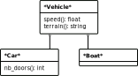
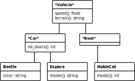
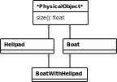
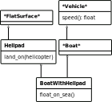

<link href='custom.css' rel='stylesheet' type='text/css'>

<!--=================================================================================================== -->
## <h2 style="color:white;">Conception de logiciel orientée objet</h2>
<!--=================================================================================================== -->
<!-- .slide: style="color:white" -->
<!-- .slide: data-background="img/code.png" -->

UE programmation orientée objet

Master bioinfo

Automne 2018

---

### Conception orientée objet

Quand on écrit un logiciel complexe,<br/>la façon dont on l'organise est importante

La __conception logicielle orientée objet__ (_object-oriented<br/>software design_) est le processus
d'organisation et de planification d'un programme orienté objet.

---

### Objectifs

* que le programme soit __flexible__ à l'utilisation
* que le code soit __facile à faire évoluer__
* que la structure du programme soit __facile à comprendre__

---

### Bonnes propriétés

* __généricité__: le code fonctionne dans plusieurs contextes
* __faible couplage__: les différentes parties du code sont indépendantes les unes des autres
* __abstraction__: on peut raisonner/travailler sur le code sans connaître les détails
* ...

---

### Généricité

> Le code fonctionne dans plusieurs contextes

* évite de dupliquer du code
* permet des usages variés
* moins de chance de devoir souvent modifier le code
* ...

---

### Faible couplage

> Les différentes parties du code sont indépendantes les unes des autres

* on peut travailler sur un morceau sans comprendre le reste
* moins de travail quand on change quelque chose
* relation entre objets plus faciles à comprendre
* ...

---

### Abstraction

> On peut raisonner/travailler sur le code<br/>sans connaître les détails

* le code est plus facile à comprendre
* il est plus facile d'écrire du code juste
* ...

---

<!--=================================================================================================== -->
## <h2 style="color:white;">Rappels concepts objet</h2>
<!--=================================================================================================== -->
<!-- .slide: style="color:white" -->
<!-- .slide: data-background="img/code.png" -->

---

### Objets

> __Objet:__ entité qui combine code et données

```python
>>> a = 1.2
>>> a.real
1.2
>>> a.is_integer()
False
```

---

### Attributs

> __Attribut:__ donnée associée à un objet

```python
>>> a.real
1.2
```

Ici, `a.real` est l'attribut `real` de l'objet `a`

---

### Méthode

> __Méthode:__ fonction associée à un objet

```python
>>> a.is_integer()
False
>>> a.is_integer
<built-in method is_integer of float object at 0x7fb92fcd4138>
```

Ici, `a.is_integer` est la méthode `is_integer` de l'objet `a`

Une méthode peut accéder aux attributs de l'objet.


---

### Classes

> __Classe:__ modèle à partir duquel<br/>des objets peuvent être créés

```python
class MyFloat:
    def __init__(self, value):
        self.real = value
    
    def is_integer(self):
        return (self.real - float(int(self.real))) == 0
```

----

#### Déclaration de méthode

```python
class MyFloat:    
    def is_integer(self):
        return (self.real - float(int(self.real))) == 0
```

Une méthode prend self en paramètre pour pouvoir accéder à l'état de l'objet via `self.<nom de l'attribut>`

----

#### Constructeur

> __Constructeur:__ méthode chargée<br/>d'initialiser l'état d'un objet créé

```python
class MyFloat:
    def __init__(self, value):
        self.real = value
```

En python, le constructeur s'appelle `__init__`

---

### Instances

> __Instance:__ objet créé à partir d'une classe

```python
a = MyFloat(1.2)
```

On dit que `a` est une instance de la classe `MyFloat`

---

### Héritage

Une classe peut __hériter__ d'une autre classe dont<br/>elle récupère toutes les méthodes et les attributs

```python
class ImprovedFloat(MyFloat):
    def is_positive(self):
        return self.real >= 0
```

```python
>>> a = ImprovedFloat(1.2)
>>> a.real
1.2
>>> a.is_positive()
True
```

Ici, `MyFloat` est la __classe mère__ et `ImprovedFloat` la __classe fille__.

----

#### Redéfinition de méthodes<br/> dans les classes filles

```python
class MyInt(ImprovedFloat):
    def is_integer(self):
        return True
```

```python
>>> a = ImprovedFloat(1.2)
>>> b = MyInt(1.2)
>>> a.is_integer()
False
>>> b.is_integer()
True
```

---

### Méthodes statiques

> __Méthode statique:__ fonction associée à<br/>une classe (plutôt qu'à une instance)

```python
class MyClass:
    @staticmethod
    def class_name():
        return "MyClass"
```

```python
>>> x = MyClass()
>>> x.class_name()
'MyClass'
>>> MyClass.class_name()
'MyClass'
```

---

### Résumé des rappels

* les __objets__ regroupent:
    * des données (les __attributs__)
    * du code (les __méthodes__)
* les __classes__ sont des modèles d'objets
    * le __constructeur__ initialise l'état d'un objet
* une __instance__ est un objet créé à partir d'une classe
* une classe peut __hériter__ d'une autre pour récuperer attributs et méthodes
    * une classe fille peut __redéfinir une méthode__ d'une classe mère

---

<!--=================================================================================================== -->
## <h2 style="color:white;">Le polymorphisme</h2>
<!--=================================================================================================== -->
<!-- .slide: style="color:white" -->
<!-- .slide: data-background="img/code.png" -->

---

### Le polymorphisme

> __Polymorphisme:__ possibilité d'interagir avec des objets de différents types de façon unifiée

```python
>>> add(1, 2)
3
>>> add(1, 2.3)
3.3
>>> add("a", "b")
'ab'
```

---

### Opérations polymorphes en python

```python
>>> 1 + 2
3
>>> "a" + "b"
'ab'
```

```python
>>> 2 * 3
6
>>> "a" * 3
'aaa'
```

```python
>>> len([1, 2, 3])
3
>>> len((1,2))
2
>>> len({1:3, 2:4})
2
```

etc...

----

#### Ma fonction polymorphe

```python
def add(a, b):
    return a + b
```

```python
>>> add(1, 2)
3
>>> add(1, 2.3)
3.3
>>> add("a", "b")
'ab'
```

---

### Polymorphisme en<br/>manipulant les types

```python
def sum(l):
    assert type(l) == list
    result = 0
    for element in l:
        result += element
    return result
```

```python
>>> sum([1, 2, 3])
6
>>> sum(["a", "b", "c"])
Traceback (most recent call last):
  File "<stdin>", line 1, in <module>
  File "<stdin>", line 4, in sum
TypeError: unsupported operand type(s) for +=: 'int' and 'str'
```
<!-- .element: class="fragment" data-fragment-index="1" -->

----

Disjonction sur le type de `l`

```python
def sum(l):
    assert type(l) == list
    assert len(l) > 0
    if type(l[0]) == str:
        zero = ""
    elif type(l[0]) == int:
        zero = 0
    for element in l:
        zero += element
    return zero
```

```python
>>> sum([1, 2, 3])
6
>>> sum(["a", "b", "c"])
'abc'
```
<!-- .element: class="fragment" data-fragment-index="1" -->

----

Refactoring avec un dictionnaire de zéros

```python
zeros = {str:"", int:0, float:0, list:[]}

def sum(l):
    assert type(l) == list
    assert len(l) > 0
    result = zeros[type(l[0])]
    for element in l:
        result += element
    return result
```

```python
>>> sum([1.2, 2, 3])
6.2
>>> sum(["a", "b", "c"])
'abc'
>>> sum([[1, 2], [3, "a"], [4]])
[1, 2, 3, 'a', 4]
```
<!-- .element: class="fragment" data-fragment-index="1" -->

---

### Polymorphisme avec des classes

Deux classes implémentant une même méthode peuvent être traitées de façon polymorphe

```python
class List3:
    "List with 3 elements"
    def __init__(self, a, b, c):
        self.value = [a, b, c]
    
    def count(self, value):
        result = 0
        for element in self.value:
            if value == element:
                result += 1
        return result
```

Par exemple `List3` implémente la méthode `count`,<br/>comme `list`

----

La méthode `count_list` ci-dessous fait la somme des `counts`<br/>de tous les éléments d'une liste

```python
def count_list(l, value):
    result = 0
    for element in l:
        result += element.count(value)
    return result
```

```python
>>> l1 = [1, 2, 1]
>>> l2 = List3(2, 1, 3)
>>> l3 = (1, 3)
>>> count_list([l1, l2, l3], 1)
4
```

---

### Résumé partie polymorphisme

* une opération qui peut traiter des objets<br/>de différents types est __polymorphe__
* python fournit de nombreuses opérations polymorphes
* on peut être polymorphe en faisant des<br/>disjonctions sur les types
* on peut être polymorphe avec des objets qui<br/>implémentent les même méthodes

---

<!--=================================================================================================== -->
## <h2 style="color:white;">Interfaces</h2>
<!--=================================================================================================== -->
<!-- .slide: style="color:white" -->
<!-- .slide: data-background="img/code.png" -->

---

### Problème: garantir/tester les objets

```python
def sum(l):
    assert type(l) == list
    assert len(l) > 0
    element_class = type(l[0])
    result = element_class.zero()
    for element in l:
        result.add(element)
    return result
```

Ici, les éléments de `l` ont besoin de:
* une méthode statique `zero`
* une méthode `add`

----

#### Double problématique
* vérifier (par ex. avec un `assert`) qu'un objet qu'on utilise implémente un ensemble de méthodes
* quand on écrit une classe, s'assurer qu'on n'a pas oublié de méthode importante

---

### Interfaces

Une interface est un ensemble de fonctionnalités

Par example, on peut décider d'appeler `Addable`<br/>l'interface constituée de :
* une méthode statique `zero`
* une méthode `add`
* une méthode `greather_or_equal`

---

### Implémentation sous forme de classes abstraites

> __Classe abstraite:__ classe qui ne peut pas être instantiée car ses méthodes ne sont pas définies

Une classe abstraite sert pour obliger des classes filles à implémenter un ensemble de méthodes

----

#### Implémentation en python

```python
from abc import ABC, abstractmethod, abstractproperty

class Addable(ABC):
    @abstractmethod
    def add(self, other):
        pass
    
    @staticmethod
    @abstractmethod
    def zero():
        pass

    @abstractmethod
    def greater_or_equal(self, other):
        pass
```

----

#### Une classe Addable

```python
class UnaryInt(Addable):
    def __init__(self, value):
        self.value = []
        for _ in range(value):
            self.value.append(None)

    def add(self, other):
        self.value += other.value

    def greater_or_equal(self, other):
        return len(self.value) >= len(other.value)
```

```python
>>> x = UnaryInt(3)
Traceback (most recent call last):
  File "<stdin>", line 1, in <module>
  File "/home/vlanore/git/prog_m1_bioinfo/code/test.py", line 143, in <module>
    x = UnaryInt(3)
TypeError: Can't instantiate abstract class UnaryInt with abstract methods zero
```
<!-- .element: class="fragment" data-fragment-index="1" -->

----

#### Corrected class

```python
class UnaryInt(Addable):
    def __init__(self, value):
        self.value = []
        for _ in range(value):
            self.value.append(None)

    def add(self, other):
        self.value += other.value

    @staticmethod
    def zero():
        return UnaryInt(0)

    def greater_or_equal(self, other):
        return len(self.value) >= len(other.value)
```

```python
>>> x = UnaryInt(3)
>>> x.value
[None, None, None]
```
<!-- .element: class="fragment" data-fragment-index="1" -->

---

### Test de la fonction `sum`

```python
def sum(l): # même fonction que tout à l'heure
    assert type(l) == list
    assert len(l) > 0
    element_class = type(l[0])
    result = element_class.zero()
    for element in l:
        result.add(element)
    return result
```

```python
>>> l = [UnaryInt(2), UnaryInt(4), UnaryInt(3)]
>>> result = sum(l)
>>> result.value
[None, None, None, None, None, None, None, None, None]
```
<!-- .element: class="fragment" data-fragment-index="1" -->


----

#### Garantir l'interface

```python
def sum(l):
    assert type(l) == list
    assert len(l) > 0
    element_class = type(l[0])
    assert issubclass(element_class, Addable) # added
    result = element_class.zero()
    for element in l:
        result.add(element)
    return result
```

```python
>>> l = [1, 2, 3]
>>> result = sum(l)
Traceback (most recent call last):
  File "code/test.py", line 148, in <module>
    print(sum_addable(l3))
  File "code/test.py", line 137, in sum_addable
    assert issubclass(element_class, Addable)
AssertionError
```
<!-- .element: class="fragment" data-fragment-index="1" -->

---

### Résumé partie interfaces

* une __interface__ est un ensemble de fonctionnalités que peut implémenter un objet
* on peut implémenter les interfaces par des __classes abstraites__
    * une classe abstraite garantit qu'on a bien implémenté les méthodes nécessaires
    * on peut vérifier qu'un objet implémente une interface

---

<!--=================================================================================================== -->
## <h2 style="color:white;">L'héritage c'est bien</h2>
<!--=================================================================================================== -->
<!-- .slide: style="color:white" -->
<!-- .slide: data-background="img/code.png" -->

---

### Structure typique d'héritage

```python
class Vehicle(ABC):
    @abstractmethod
    def terrain(self):
        pass
    
    @abstractmethod
    def speed(self):
        pass

class Car(Vehicle):
    def terrain(self):
        return "ground"

    @abstractmethod
    def nb_doors(self):
        pass

class Boat(Vehicle):
    def terrain(self):
        return "water"
```

----

#### Diagramme de classes



----

#### Classes concrètes

```python
class Beetle(Car):
    def __init__(self, color):
        self.color = color

    def nb_doors(self):
        return 3
        
    def speed(self):
        return 100
```

```python
>>> my_car = Beetle("blue")
>>> my_car.terrain()
'ground'
>>> my_car.speed()
100
>>> issubclass(type(my_car), Car)
True
>>> issubclass(type(my_car), Boat)
False
>>> issubclass(type(my_car), Vehicle)
True
```
<!-- .element: class="fragment" data-fragment-index="1" -->

----

#### Diagramme de classes



---

### Avantages

* L'arbre d'héritage fournit une __taxonomie__ des objets<br/>(abstraction)

```python
>>> my_car = Beetle("blue")
>>> issubclass(type(my_car), Car)
True
>>> issubclass(type(my_car), Boat)
False
>>> issubclass(type(my_car), Vehicle)
True
```
<!-- .element: class="fragment" data-fragment-index="1" -->

----

* Réutilisation du code des classes parentes<br/>(code facile à étendre)

```python
class Beetle(Car):
    def __init__(self, color):
        self.color = color

    def nb_doors(self):
        return 3
        
    def speed(self):
        return 100
```
<!-- .element: class="fragment" data-fragment-index="1" -->

```python
>>> my_car = Beetle("blue")
>>> my_car.terrain()
'ground'
```
<!-- .element: class="fragment" data-fragment-index="1" -->

----

(Changer juste un détail d'une classe est facile)

```python
class BrokenBeetle(Beetle):
    def speed(self):
        return 0
```

```python
>>> my_car = Beetle("blue")
>>> my_old_car = BrokenBeetle("green")
>>> my_old_car.speed()
0
>>> my_car.speed()
100
>>> my_old_car.color
'green'
>>> my_old_car.color
'green'
>>> my_old_car.nb_doors()
3
```
<!-- .element: class="fragment" data-fragment-index="1" -->

----

* Polymorphisme sur les descendants d'une classe<br/>(généricité)

```python
def car_info(car):
    assert issubclass(type(car), Car)
    return "This car has {} doors and its top speed is {}km/h"\
        .format(car.nb_doors(), car.speed())
```

```python
>>> my_old_car = Beetle("blue")
>>> my_car = Espace()
>>> car_info(my_old_car)
'This car has 5 doors and its top speed is 180km/h'
>>> car_info(my_car)
'This car has 3 doors and its top speed is 100km/h'
```

---

### Résumé des avantages de l'héritage

* permet de __spécialiser__ des objets étape par étape
* fournit une __taxonomie__
* __réutilisation__ de code des classes parentes
* __polymorphisme__ sur les descendants d'une classe

---

<!--=================================================================================================== -->
## <h2 style="color:white;">L'héritage c'est dangereux</h2>
<!--=================================================================================================== -->
<!-- .slide: style="color:white" -->
<!-- .slide: data-background="img/code.png" -->

---

### Mauvais usage de l'héritage

Il peut être tentant d'hériter d'une classe `C` pour réutiliser son code même si on n'est pas un cas particulier de `C`

----

#### Exemple: besoin d'un bateau avec un hélipad


----

Ben je n'ai qu'à créer une classe de Bateau<br/>qui hérite de la classe Helipad


----

__Problème__: un bateau avec un hélipad n'est pas un hélipad

* utiliser `BoatWithHelipad` dans un contexte qui attend un `Helipad` peut faire n'importe quoi
* le typage / la taxonomie n'a plus aucun sens
* encourage l'héritage multiple

----

#### Principe de substitution de Liskov

Une classe __F__ ne doit hériter d'une classe __M__ que si tout objet de classe __M__ peut être remplacé par un objet de classe __F__

---

### L'héritage multiple est dangereux

Risque de conflit sur les définitions


----

#### Héritage en diamant



---

### Problèmes liés à la hiérarchie

* il n'est pas toujours évident de savoir où mettre une méthode ou un attribut

----


----

* un objet peut se retrouver à cheval entre plusieurs hiérarchies


---

### Résumés des mises en garde

* ne pas hériter quand `F` n'est pas une spécialisation de `M`
    * principe de substitution de Liskov
* éviter l'héritage multiple
* éviter d'avoir plusieurs hiérarchies qui se mélangent

----

Quand un code commence à avoir<br/>ce genre de problèmes (_code smells_):


---

<!--=================================================================================================== -->
## <h2 style="color:white;">Comment se passer de l'héritage</h2>
<!--=================================================================================================== -->
<!-- .slide: style="color:white" -->
<!-- .slide: data-background="img/code.png" -->

---

### Pour réutiliser: la composition

Plutôt que d'hériter de `C`, détenir une instance de `C` en attribut

Potentiellement rediriger certaines méthodes vers l'attribut

----

Au lieu de faire de l'héritage...

```python
class Helipad():
    def land_on(self, helicopter):
        print("Helicopter {} lands on me!".format(helicopter))

class BoatWithHelipad(Boat, Helipad):
    def float_on_sea(self):
        print("I float on the sea!")
```

----

...avoir un attribut dont on récupère la fonctionnalité

```python
class Helipad():
    def land_on(self, helicopter):
        print("Helicopter {} lands on me!".format(helicopter))

class BoatWithHelipad(Boat):
    def __init__(self):
        self.helipad = Helipad()

    def land_on_helipad(self, helicopter):
        self.helipad.land_on(helicopter)

    def float_on_sea(self):
        print("I float on the sea!")
```

----

#### Avantages

* mon bateau n'__est__ pas un hélipad, il __possède__ un hélipad
* peut utiliser `self.helipad` si besoin d'un helipad
* pas de risque de conflit de méthode/d'attribut

---

### Pour le polymorphisme/typage : les interfaces

Plutôt qu'avoir une hiérarchie de __classes avec des implémentations__ qui représentent ce que les objets __sont__...

...avoir des objets qui héritent directement d'__interfaces__, qui représentent ce que les objets __font__

----

Par exemple, plutôt que d'avoir



----

...préférer la structurer suivante :


(où toutes les classes abstraites sont des<br/>interfaces et donc __sans implémentation__)

----

#### Avantages

* pas de conflit sur les implémentations
* probabilité de conflit sur les noms plus faible (pas de diamants)
* pas de problèmes de hiérarchies multiples
* plus modulaire (pas limité par la hiérarchie)

---

### Conclusions héritage

> Dans le doute, préférer la __composition__ à l'héritage

--

> Dans le doute, préférer les __interfaces__ aux hiérarchies de classes avec implémentation

----

#### L'héritage est utile

* pour faire des modifications simples au comportement d'une classe (`Beetle` -> `BrokenBeetle`)
* quand un programme s'écrit bien avec<br/>une seule hiérarchie de classes

---

<!--=================================================================================================== -->
## <h2 style="color:white;">Les _design patterns_</h2>
<!--=================================================================================================== -->
<!-- .slide: style="color:white" -->
<!-- .slide: data-background="img/code.png" -->

---

### _Design patterns_

> __Design pattern :__ technique de conception objet permettant de résoudre un problème courant

----


---

### _Adaptor pattern_

__Problème :__ j'ai envie de me servir d'un objet qui n'a pas exactement la bonne interface

__Solution :__ créer un objet "adaptateur" qui va faire la conversion d'interface